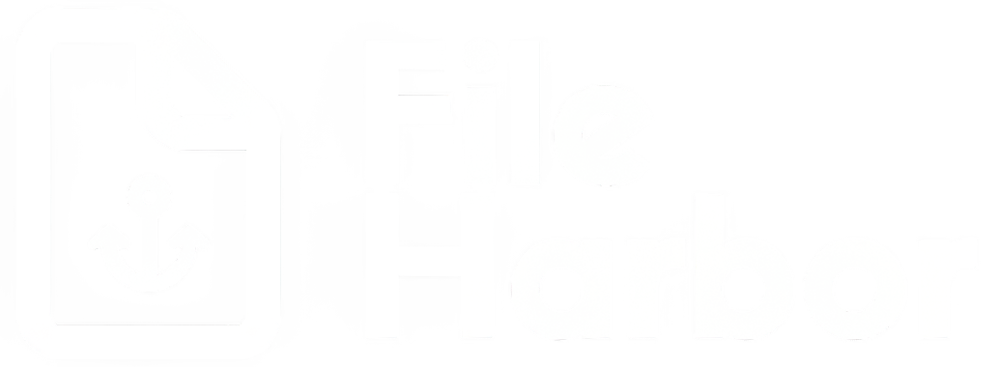

<p align="center">
  <a href="https://github.com/heyatomdev/gatherly" target="blank"></a>
</p>

<p align="center">
Multi-tenant event manager built with NestJS 10, Prisma ORM, and PostgreSQL.
</p>
<p align="center">
    <a href="https://www.npmjs.com/~nestjscore" target="_blank"></a>
    <a href="https://github.com/heyatomdev/gatherly/blob/main/LICENSE.md" target="_blank"></a>
</p>


## Caratteristiche

- **Multi-tenant**: Ogni client ha accesso solo ai propri eventi tramite token
- **Gestione Partecipanti**: Aggiungi e rimuovi partecipanti agli eventi
- **Eventi Ricorrenti**: Crea eventi che si ripetono settimanalmente/mensilmente/annualmente
- **RRULE Support**: Utilizza lo standard RFC 5545 per le ricorrenze
- **Auto Cleanup**: Pulizia automatica degli eventi passati

## Setup

### 1. Installa dipendenze

```bash
pnpm install
```

### 2. Configura il database

```bash
cp .env.example .env
# Modifica .env con i tuoi dati di connessione PostgreSQL
```

### 3. Esegui le migrazioni

```bash
pnpm prisma:migrate
pnpm prisma:generate
```

### 4. Avvia l'applicazione

```bash
pnpm start:dev
```

L'app sarà disponibile su `http://localhost:3000`

## API Endpoints

### Clients

Nessun endpoint pubblico per i client. Li crea un SUPER_ADMIN da Meridian → Gatherly → Clients
(`/admin/clients`, Bastion user JWT con ruolo SUPER_ADMIN). Ogni client è legato a un `tenantId` Bastion.

### Events

Tutti gli endpoint degli eventi richiedono un service-client JWT Bastion: `Authorization: Bearer <jwt>`

#### Crea un evento
```bash
POST /events
Headers: Authorization: Bearer <jwt>
Content-Type: application/json

{
  "title": "Weekly Team Meeting",
  "description": "Discussione settimanale",
  "authorId": "user123",
  "authorName": "John Doe",
  "startTime": "2026-03-05T14:00:00Z",
  "recurrenceRule": "FREQ=WEEKLY;BYDAY=WE;INTERVAL=1"
}
```

Risposta:
```json
{
  "id": "cluxxxxxx",
  "title": "Weekly Team Meeting",
  "description": "Discussione settimanale",
  "clientId": "cluxxxxxx",
  "authorId": "user123",
  "authorName": "John Doe",
  "startTime": "2026-03-05T14:00:00Z",
  "isRecurring": true,
  "recurrenceRule": "FREQ=WEEKLY;BYDAY=WE;INTERVAL=1",
  "participants": [],
  "createdAt": "2026-02-26T10:00:00Z",
  "updatedAt": "2026-02-26T10:00:00Z"
}
```

#### Ottieni tutti gli eventi del client
```bash
GET /events
Headers: Authorization: Bearer <jwt>
```

#### Ottieni un evento specifico
```bash
GET /events/:eventId
Headers: Authorization: Bearer <jwt>
```

#### Aggiungi un partecipante
```bash
POST /events/:eventId/participants
Headers: Authorization: Bearer <jwt>
Content-Type: application/json

{
  "userId": "user456",
  "userName": "Jane Smith"
}
```

#### Rimuovi un partecipante
```bash
DELETE /events/:eventId/participants/:userId
Headers: Authorization: Bearer <jwt>
```

## Esempi di RRULE

### Ogni settimana (lunedì)
```
FREQ=WEEKLY;BYDAY=MO
```

### Ogni due settimane (lunedì e giovedì)
```
FREQ=WEEKLY;BYDAY=MO,TH;INTERVAL=2
```

### Ogni mese (primo giorno)
```
FREQ=MONTHLY;BYMONTHDAY=1
```

### Ogni giorno feriale
```
FREQ=DAILY;BYDAY=MO,TU,WE,TH,FR
```

## Architettura

### Schema del Database

```
Client (1) ---< (M) Event
Event (1) ---< (M) Participant
Event (Parent) ---< (Child) Event (per ricorrenze)
```

### Flusso di Autenticazione

1. Il chiamante ottiene un service-client JWT da Bastion (`POST /auth/client`) e lo invia come `Authorization: Bearer <jwt>`
2. `BastionJwtGuard` (globale) verifica la firma RS256 via JWKS e risolve il client attivo legato al `tenantId` del token
3. Request viene arricchita con `req.client` contenente i dati del client
4. Tutti i servizi filtrano i dati per `clientId`

Le route `/admin/*` usano invece un Bastion user JWT, verificato dai guard dei singoli controller.

### Gestione Ricorrenze

1. Quando crei un evento ricorrente, viene creato l'evento genitore
2. Automaticamente vengono generate 52 istanze (1 anno) dell'evento
3. Ogni istanza ha `parentEventId` che punta all'evento genitore
4. Un cron job giornaliero (ore 2:00) elimina le istanze scadute

## Sviluppo

### Comandi utili

```bash
# Avvia in modalità development con watch
pnpm start:dev

# Build per production
pnpm build

# Esegui migrazioni Prisma
pnpm prisma:migrate

# Genera Prisma Client
pnpm prisma:generate
```

### Struttura dei file

```
src/
├── main.ts               # Entry point
├── configs/              # Validazione env (config.validation.ts)
├── guards/               # AdminThrottlerGuard
└── modules/
    ├── app/              # AppModule
    ├── bastion/          # JWKS, BastionJwtGuard, guard admin
    ├── admin/            # /admin/* (Meridian)
    ├── clients/          # ClientService (niente controller)
    ├── events/           # Eventi, partecipanti, ricorrenze
    ├── categories/
    ├── tags/
    ├── webhook/          # Outbox + delivery webhook
    └── prisma/           # PrismaService (@Global)
```

## Troubleshooting

### Errore: "Prisma Client not generated"
```bash
pnpm prisma:generate
```

### Errore: "Database connection failed"
Verifica che:
- PostgreSQL sia in esecuzione
- L'URL di connessione in `.env` sia corretta
- I permessi del database siano corretti

### Errore 401 "Client non autorizzato"
Assicurati che:
- Esista un client attivo per il `tenantId` del JWT (creato da Meridian → Gatherly → Clients)
- Il JWT sia un service-client token Bastion valido, inviato come `Authorization: Bearer <jwt>`

## License

MIT

